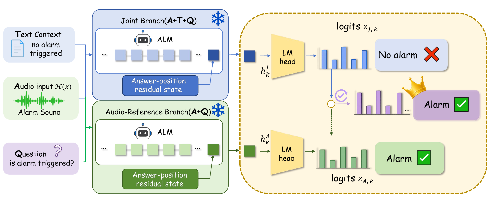

<div align="center">

# Beyond Text Following: Repairable Arbitration Reversals in Audio-Language Models

**The official implementation of [Beyond Text Following: Repairable Arbitration Reversals in Audio-Language Models](https://arxiv.org/abs/2606.05161)** — **EMNLP 2026 Main Conference**.

[](https://arxiv.org/abs/2606.05161)
[](https://2026.emnlp.org/)
[](LICENSE)
[](https://github.com/Yichen-Gao/arbitration-reversal-gacl/actions/workflows/ci.yml)



</div>

## Abstract

Audio-language models often follow text that conflicts with the audio, even when the audio evidence is unambiguous. We ask whether the audio-supported answer is genuinely unavailable, or whether it is already represented by the model but overridden during cross-modal arbitration. Across five audio-language models and four audio-text conflict tasks, we find that **64.1% of conflict samples are repairable**: the same-audio reference branch already ranks the audio answer first. We propose **GACL** (**G**ated **A**udio **C**ounterfactual **L**ogit Correction), a training-free decoding rule that detects when arbitration has reversed a reliable audio-supported answer and interpolates the joint scores back toward that answer. GACL recovers **+41.7 pp** macro conflict accuracy over the joint baseline while keeping the faithful-accuracy drop at **4.2 pp**, and outperforms contrastive decoding under a strict faithfulness budget. The same rule transfers to vision-language models without retuning.

## Why GACL

Audio-language models are often overly text-following: when a transcript says one thing and the audio clearly says another, the model frequently answers from the text. GACL repairs this at inference time by combining three cheap, interpretable signals:

- **`N_out`** — the joint and same-audio reference branches disagree;
- **`R_A`** — the audio reference branch is confident about its answer;
- **`s_A − s_J`** — the score displacement that moves the joint candidate toward the audio-supported candidate.

The corrected score keeps the joint ranking when the gate is off, and interpolates toward the reference branch when the gate fires — without extrapolating past the reference:

```text
α(x)    = clip(λ · R_A(x) · N_out(x), 0, 1)
s_GACL  = s_J + α(x) · (s_A − s_J)
```

The implementation lives in [`src/methods/gacl.py`](src/methods/gacl.py). No fine-tuning, no gradients, and no extra model weights are required.

## Key Results

Macro results over 20 audio-language model × task conflict cells (test set, 200 samples per cell; selected on dev under a 5 pp faithful-drop budget):

| Method | Conflict acc. | Gain vs. Joint | Faithful acc. | Faithful drop |
| --- | ---: | ---: | ---: | ---: |
| Joint | 15.0% | — | 97.2% | — |
| AAD@5pp | 35.5% | +20.6 pp | 94.0% | 3.2 pp |
| ACD@5pp | 37.7% | +22.1 pp | 94.1% | 3.0 pp |
| **GACL@5pp** | **56.7%** | **+41.7 pp** | **92.9%** | **4.2 pp** |

Diagnostic headline numbers:

| Signal | Value | Meaning |
| --- | ---: | --- |
| Repairable reversal | **64.1%** | conflict samples where the audio reference already ranks the audio answer first |
| Audio-reference accuracy | **76.6%** | macro accuracy of the same-audio reference branch |
| nAUC gain | **+17.8 pp** | GACL over the best contrastive baseline under a 5 pp faithful-drop budget |
| MC2 transfer | **+40.5 pp** | Qwen3-VL-2B vision-following gain with a fixed, untuned GACL |
| Patch-to-score alignment | **0.93** | Spearman ρ between patch-induced and candidate-score displacement |

All numbers are printed from the bundled score artifacts by `python scripts/demo.py`; the per-model, per-task tables are in [`data/cached/scores/main_results.csv`](data/cached/scores/main_results.csv).

## Installation

The demo and reproduction code require Python 3.10+ and only `numpy`, `matplotlib`, and `pyyaml`.

**With conda**

```bash
conda env create -f environment.yml
conda activate gacl
```

**With pip**

```bash
python -m venv .venv
source .venv/bin/activate          # Windows: .venv\Scripts\activate
pip install -r requirements.txt
```

## Quick Start

The repository bundles the paper-facing score artifacts, so you can reproduce the headline tables and figures without downloading raw audio or running model inference.

```bash
git clone https://github.com/Yichen-Gao/arbitration-reversal-gacl.git
cd arbitration-reversal-gacl
python scripts/demo.py
```

`scripts/demo.py` prints the macro table, reversal diagnostics, GACL nAUC, the MC2 vision-text transfer, and the ablation headline.

### Reproduce figures

```bash
python scripts/demo.py --figures
```

This regenerates Figures 2, 3, and 5 into `assets/figures/` from the cached artifacts:

| Figure | Content | Script |
| --- | --- | --- |
| Fig. 2 | Repairable-reversal margins | `src/plotting/plot_fig2_margins.py` |
| Fig. 3 | Patch-to-score mechanism bridge | `src/plotting/plot_fig3_bridge.py` |
| Fig. 5 | Rescue-faithfulness frontier | `src/plotting/plot_fig5_frontier.py` |

### Run GACL on cached candidate scores

```bash
python scripts/run_gacl_cached.py --limit 20
python scripts/run_gacl_cached.py --lambda-value 1.0 --tau-a 0.5 --limit 20
```

Use `--input` to point at another JSONL cache and `--output out.jsonl` to write instead of printing.

## Reproducing Full Inference

The default commands use cached scores. To reproduce full model inference, download the upstream benchmarks and regenerate the cached artifacts:

```bash
bash data/download_mcrbench.sh
bash data/download_alme.sh
bash data/download_mc2.sh
```

The upstream sources, the public split IDs in `data/splits/`, and the expected `data/raw/` layout are documented in [`data/README.md`](data/README.md). Raw audio, images, and model weights are intentionally not redistributed in this repository.

## Repository Structure

```text
arbitration-reversal-gacl/
├── assets/                  # Hero figure and pre-generated paper figures
├── configs/                 # Model, task, baseline, GACL, and prompt settings
├── data/
│   ├── cached/              # Paper-facing score artifacts used by the demo
│   ├── splits/              # Public dev/test IDs for the four audio-text tasks
│   ├── download_*.sh        # Upstream dataset downloaders
│   └── README.md            # Dataset and artifact documentation
├── scripts/
│   ├── demo.py              # One-command headline tables (+ --figures)
│   └── run_gacl_cached.py   # Minimal GACL scoring over cached score rows
├── src/
│   ├── methods/             # GACL, AAD, ACD, and DoLa scoring rules
│   ├── eval/                # Metrics, bootstrap, margins, rescue-faithfulness
│   ├── plotting/            # Figure 2/3/5 generators and shared style
│   ├── data/                # Prompt builders, answer normalization, verbalizers
│   └── analysis/            # Patch-to-score alignment (Spearman ρ)
├── tests/                   # Unit tests for the GACL formula and patch alignment
├── environment.yml          # Conda environment
├── requirements.txt         # Minimal Python dependencies
├── pyproject.toml           # Package metadata and pytest configuration
├── CITATION.cff             # Machine-readable citation metadata
└── LICENSE                  # MIT license
```

## Tests

```bash
pip install pytest
python -m pytest -q
```

The suite checks the core GACL interpolation rule and the cached patch-to-score alignment; GitHub Actions runs it on Python 3.10 and 3.11.

## Citation

If you use this code or the accompanying results, please cite:

```bibtex
@article{gao2026beyond,
  title={Beyond Text Following: Repairable Arbitration Reversals in Audio-Language Models},
  author={Gao, Yichen and Zhang, Yiqun and Wang, Zijing and Li, Yujia and Guo, Heng and Wu, Xi and Yang, Xiaocui and Feng, Shi and Zhang, Yifei and Wang, Daling},
  journal={arXiv preprint arXiv:2606.05161},
  year={2026},
  note={Accepted to EMNLP 2026 Main Conference}
}
```

A machine-readable [`CITATION.cff`](CITATION.cff) is also included.

## Contact

For questions about the paper or this repository, open a [GitHub issue](https://github.com/Yichen-Gao/arbitration-reversal-gacl/issues) or contact the authors listed in the citation.

## License

Released under the [MIT License](LICENSE).
